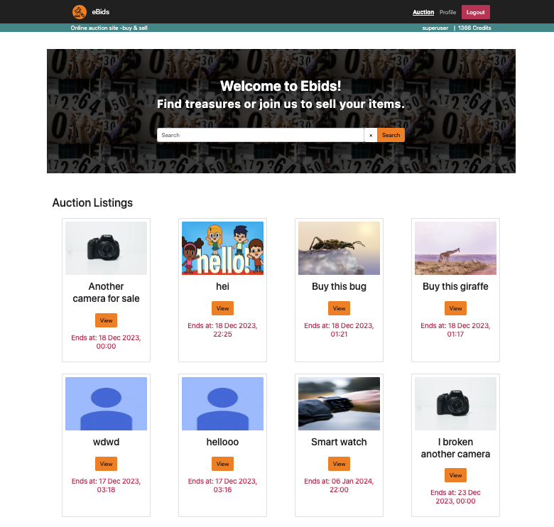

# Semester Project 2


## General info
eBids is an auction site is looking to launch a website where users can add items to be bid on and bid on items other users have put up for auction. The school project must contain these user stories:
- A user with a stud.noroff.no email may register
- A registered user may login
- A registered user may logout
- A registered user may update their avatar
- A registered user may view their total credit
- A registered user may create a Listing with a title, deadline date, media gallery and description
- A registered user may add a Bid to another user’s Listing
- A registered user may view Bids made on a Listing
- An unregistered user may search through Listings

## Built with
- HTML
- CSS/SASS/SCSS
- Javascript

### Frameworks
- Bootstrap 5.3.1

## Getting started
### Installing
1. Clone the repo
````
git clone https://github.com/chalund/SemesterProject-2.git
````

2. Install dependencies
````
npm i
````

3. Build SAS
````
npm run build
````
````
npm run watch
````

## Links
- Netlify: https://ebids.netlify.app
- Prototype in Figma https://www.figma.com/file/N2WLPiPLlbPU3urQGSFV0S/Semester-Project?type=design&node-id=112%3A392&mode=design&t=JdpiFOHiFcsJBCk3-1
- Style Tile https://www.figma.com/file/N2WLPiPLlbPU3urQGSFV0S/Semester-Project?type=design&node-id=121%3A6&mode=design&t=JdpiFOHiFcsJBCk3-1

## Contact
[](mailto:chalund@gmail.com)
[](https://pe.linkedin.com/in/charlotte-lund-48419b249/)
[](https://github.com/chalund)